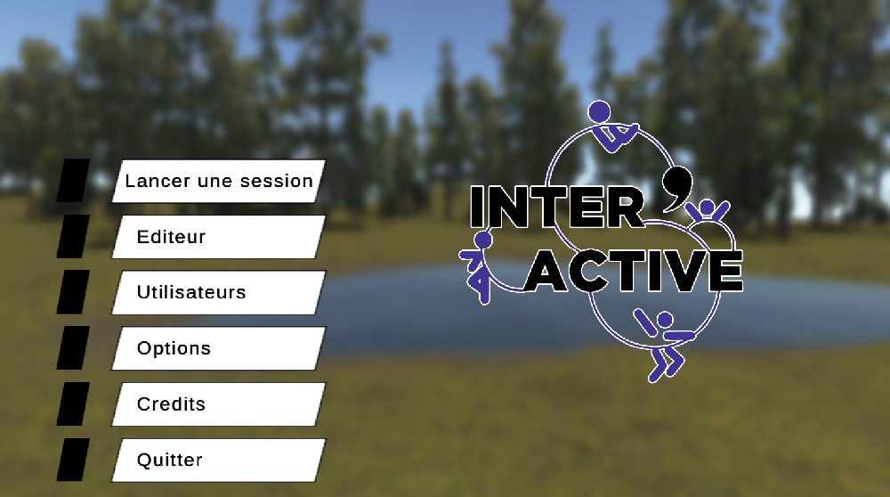
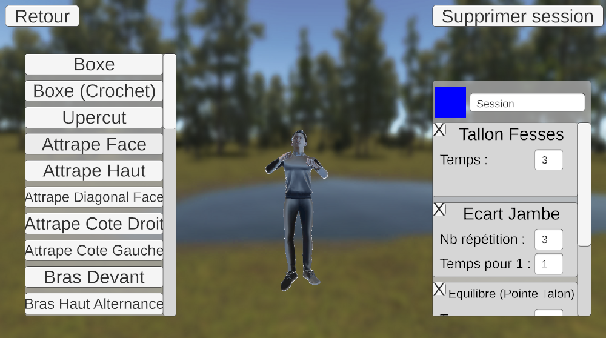
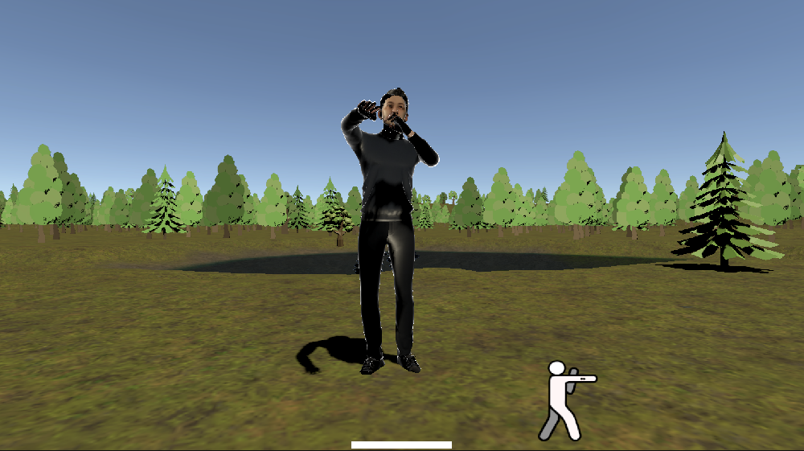
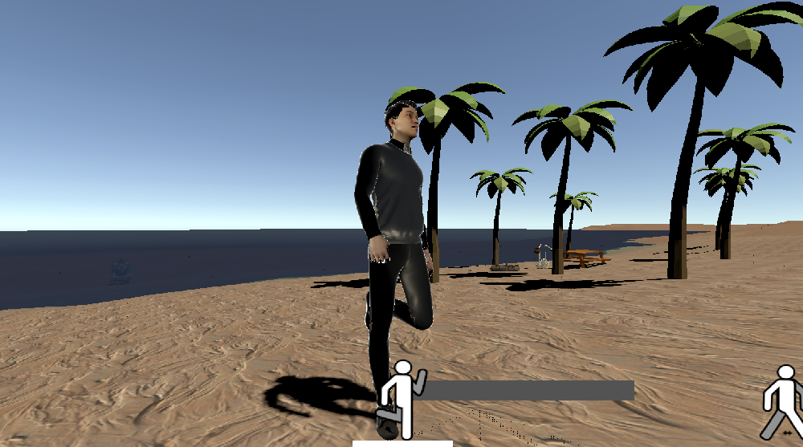

# Logiciel Inter'activ
Ce git est le git du projet Inter'Activ, réalisé par 3 étudiants en BUT Informatique pour notre SAE de 3ème année.

Le client de ce projet est l'association Équilibre, association belfortaine aidant des personnes en situation de handicap à se remettre en forme.

Le projet avait déjà été commencé par un groupe précédent, mais nous avons décider de ne garder de leur projet que les besoins clients qu'ils avaient identifiés.

# Compétences acquises
- Unity Engine
- C#
- Android
- Microcontrôleurs

# Description du logiciel
Le logiciel a pour but d'aider les responsables de séances de l'association à faire le travail, et à rendre ces dernières plus intéressantes.

Pour cela, nous avons crée un logiciel avec Unity Engine, qui permet de créer / modifier des séances, et de les lancer.

Une séance se compose de plusieurs mouvements, qui durent plus ou moins longtemps (ex : 4 Squats, puis 10 secondes de course).

Le déroulement d'une séance est similaire à celui d'une chanson de Just Dance : les participants doivent réaliser les mouvements que réalise un personnage à l'écran.

Le logiciel permet aussi d'enregistrer les participants dans une base de données JSON, qui sera utilisée pour faire des statistiques (Nombres de mouvements réussit, ...).

Une application Android a aussi été crée pour permettre au responsable de séance, de spécifier en temps réel qui à réussit quel mouvement. Ces informations seront ensuite sauvegardé pour faire des statistiques.

## Développeurs
Julien OUDOT
 - Chef de Projet
 - Création des différents mouvements (Animations)
 - Code général du logiciel (Mouvements, Séances, ...)
 - Création du système de sauvegarde de fichier (JSON)
 - Implémentation application Android
   
Titouan NICOT
 - Maquette des interfaces graphiques
 - Implémentation des interfaces graphiques
 - Implémentation application Android
   
Justin VILLEROT
 - Décors

## Notes
Bien que nous avons utilisé Unity Engine pour créer le projet, nous n'avons pas réellement eu à utiliser de notions de Game Design, ni de Level Design. 

Les besoins de l'association ont été recueilli lors d'une réunion ou toutes les personnes liées au projet était conviées. Titouan NICOT s'est chargé de prendre en notes ces besoins.

## Screenshots

